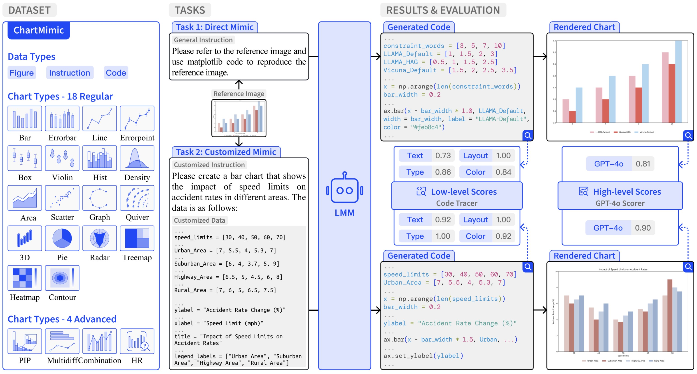

<div align="center">

<h1> ChartMimic: Evaluating LMM’s Cross-Modal Reasoning Capability via Chart-to-Code Generation
 </h1>
</div>

<div align="center">


</div>

<div align="center">
  <!-- <a href="#model">Model</a> • -->
  🌐 <a href="https://chartmimic.github.io/">Website</a> |
  🏆 <a href="https://chartmimic.github.io/">Leaderboard</a> |
  📚 <a href="https://huggingface.co/datasets/ChartMimic/ChartMimic">Data</a> |
  📃 <a href="https://arxiv.org/abs/2406.09961">Paper</a>
</div>

## 🎉 What's New


- **[2025.06.18]** 🔧 ChartMimic has been integrated into [VLMEvalKit](https://github.com/open-compass/VLMEvalKit/pull/1056). Welcome to use ChartMimic through [VLMEvalKit](https://github.com/open-compass/VLMEvalKit/pull/1056)! Special thanks to the VLMEvalKit team.
- **[2025.02.01]** 🥳 ChartMimic is accepted by ICLR 2025.
- **[2024.06.13]** 📣 ChartMimic is released.

## 🎏 Introduction

ChartMimic aims at assessing **the visually-grounded code generation capabilities** of large multimodal models (LMMs). ChartMimic utilizes information-intensive visual charts and textual instructions as inputs, requiring LMMs to generate the corresponding code for chart rendering.

ChartMimic includes **4,800 human-curated (figure, instruction, code) triplets**, which represent the authentic chart use cases found in scientific papers across various domains(e.g., Physics, Computer Science, Economics, etc). These charts span 18 regular types and 4 advanced types, diversifying into 201 subcategories. Furthermore, we propose **multi-level evaluation metrics** to provide an automatic and thorough assessment of the output code and the rendered charts. Unlike existing code generation benchmarks, ChartMimic places emphasis on evaluating LMMs' capacity to harmonize a blend of cognitive capabilities, encompassing **visual understanding, code generation, and cross-modal reasoning**.

<div align="center">

</div>

## 📄 Table of Contents

<details>
<summary>
Click to expand the table of contents
</summary>

- [🎉 What's New](#whats-new)
- [🎏 Introduction](#introduction)
- [🚀 Quick Start](#-quick-start)
  - [Setup Environment](#setup-environment)
  - [Download Data](#download-data)
  - [Evaluate Models](#evaluate-models)
- [📚 Data](#-data)
- [💬 Citation](#-citation)
- [📌 License](#-license)
- [🎙️ Acknowledgements](#️-acknowledgements)

</details>

## 🚀 Quick Start

Here we provide a quick start guide to evaluate LMMs on ChartMimic.
> Kind Note: ChartMimic has been integrated into [VLMEvalKit](https://github.com/open-compass/VLMEvalKit/pull/1056). Welcome to use ChartMimic through [VLMEvalKit](https://github.com/open-compass/VLMEvalKit/pull/1056)!

### Setup Environment

```shell
conda env create -f environment.yaml
conda activate chartmimic
```

Set up the environment variables in `.env` file.

```shell
PROJECT_PATH=${YOUR_PROJECT_PATH}
OPENAI_BASE_URL=${YOUR_OPEN_AI_BASE_URL}
OPENAI_API_KEY=${YOUR_OPENAI_API_KEY}
ANTHROPIC_API_KEY=${YOUR_ANTHROPIC_API_KEY}
GOOGLE_API_KEY=${YOUR_ANTHROPIC_API_KEY}
```

### Download Data

You can download the whole evaluation data by running the following command:

```shell
cd ChartMimic # cd to the root directory of this repository
mkdir dataset
wget https://huggingface.co/datasets/ChartMimic/ChartMimic/resolve/main/dataset-iclr.tar.gz
tar -xzvf dataset-iclr.tar.gz -C dataset
```

### Evaluate Models

#### Task 1: Direct Mimic

Example script for `gpt-4-vision-preview` on the `Direct Mimic` task:

```shell
export PROJECT_PATH=${YOUR_PROJECT_PATH}

# Step 1: Get Model Reponse
bash scripts/direct_mimic/run_generation.sh

# Step 2: Run the Code in the Response
bash scripts/direct_mimic/run_code.sh

# Step 3: Get Lowlevel Score
bash scripts/direct_mimic/run_evaluation_lowlevel.sh

# Step 4: Get Highlevel Score
bash scripts/direct_mimic/run_evaluation_highlevel.sh
```

#### Task 2: Customized Mimic

Example script for `gpt-4-vision-preview` on the `Customized Mimic` task:

```shell
export PROJECT_PATH=${YOUR_PROJECT_PATH}

# Step 1: Get Model Reponse
bash scripts/customized_mimic/run_generation.sh

# Step 2: Run the Code in the Response
bash scripts/customized_mimic/run_code.sh

# Step 3: Get Lowlevel Score
bash scripts/customized_mimic/run_evaluation_lowlevel.sh

# Step 4: Get Highlevel Score
bash scripts/customized_mimic/run_evaluation_highlevel.sh
```

#### Different LMMs

We now offer configuration for 14 SOTA LMM models (`gpt-4-vision-preview`, `claude-3-opus-20240229`, `gemini-pro-vision`, `Phi-3-vision-128k-instruct`,`MiniCPM-Llama3-V-2_5`,`InternVL-Chat-V1-5`, `cogvlm2-llama3-chat-19B`,`deepseekvl`,`llava-v1.6-mistral-7b-hf`,`llava-v1.6-34b-hf`, `idefics2-8b`, `llava-v1.6-vicuna-13b-hf`,`llava-v1.6-vicuna-7b-hf` and `qwenvl`).
 <!-- and a simple agent based on direct prompting. You could also customize your own [agents](https://github.com/hkust-nlp/AgentBoard/blob/main/assets/agent_customization.md) and [LMMs](https://github.com/hkust-nlp/AgentBoard/blob/main/assets/llm_customization.md). Models supported by [vLLM](https://github.com/vllm-project/vllm) should be generally supported in AgentBoard, while different models may require specific prompt templates. -->

<!-- #### Different Prompting Methods -->

## 📚 Data

You can download the whole evaluation data by running the following command:

### [New Version](https://arxiv.org/abs/2406.09961v2)

```shell
cd ChartMimic # cd to the root directory of this repository
mkdir dataset
wget https://huggingface.co/datasets/ChartMimic/ChartMimic/resolve/main/dataset-iclr.tar.gz
tar -xzvf dataset-iclr.tar.gz -C dataset
```

To help researchers quickly understand evaluation data, we provide Dataset Viewer at Huggingface Dataset: 🤗 [ChartMimic](https://huggingface.co/datasets/ChartMimic/ChartMimic).

The file structure of evaluation data is as follows:

```
.
├── customized_1800/
├── customized_600/
├── direct_1800/
└── direct_600/
```

### [Old Version](https://arxiv.org/abs/2406.09961v1)
⚠️ For old version, please use the `dimentions_info.jsonl` and `dimentions_info_edit.jsonl` under the [`legacy`](https://github.com/ChartMimic/ChartMimic/tree/main/legacy) folder.
```shell
cd ChartMimic # cd to the root directory of this repository
mkdir dataset
wget https://huggingface.co/datasets/ChartMimic/ChartMimic/resolve/main/dataset-old.tar.gz
tar -xzvf dataset-old.tar.gz -C dataset
```

The file structure of evaluation data is as follows:

```
.
├── customized_500/ # Data for Customized Mimic
├── ori_500/  # Data for Direct Mimic
└── test.jsonl  # Data for both tasks
```

## 💬 Citation

If you find this repository useful, please consider giving star and citing our paper:

```
@article{yang2024chartmimic,
        title={Chartmimic: Evaluating lmm's cross-modal reasoning capability via chart-to-code generation},
        author={Yang, Cheng and Shi, Chufan and Liu, Yaxin and Shui, Bo and Wang, Junjie and Jing, Mohan and Xu, Linran and Zhu, Xinyu and Li, Siheng and Zhang, Yuxiang and others},
        journal={arXiv preprint arXiv:2406.09961},
        year={2024}
}
```

## 📌 License

[](https://www.apache.org/licenses/LICENSE-2.0)

The ChartMimic data and codebase is licensed under a [Apache-2.0 License](https://www.apache.org/licenses/LICENSE-2.0).

## 🎙️ Acknowledgements

We would like to express our gratitude to [agentboard](https://github.com/hkust-nlp/AgentBoard) for their project codebase.

<!-- ## Scaffold Agent
1. Generate dot picture
```shell
python chart2code/utils/data_process/dot_processor.py
```

2. Run chart2code task
```shell
bash run.sh
```# ChartMimic -->
